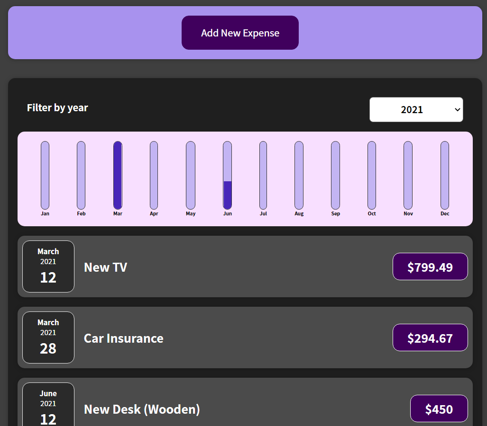

#  Budget app created with React 

This application is a simple expense app utilizing react.js. The concept behind this application was to implement state and working with events. Working with reacts basic components is another part of this applications background.

## Screenshot


## Installation

Simply download the files and install necessary dependencies.

```
npm init / npm install

```

## Developer

[Erik Williams](https://epw80.github.io/react-portfolio-static/)

